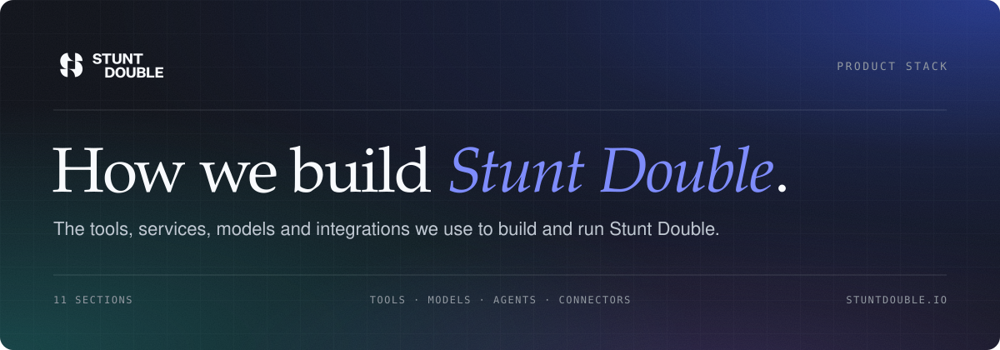

# Product Stack

  

An overview of the tools, services, AI tooling and integrations we use to build and run [Stunt Double](https://stuntdouble.io).

<a href="#daily-drivers">01 Daily Drivers</a> · <a href="#engineering">02 Engineering</a> · <a href="#design">03 Design</a> · <a href="#models">04 Models</a> · <a href="#ai-and-agents">05 AI and Agents</a> · <a href="#claude-code-setup">06 Claude Code Setup</a> · <a href="#open-source">07 Open Source</a> · <a href="#payments-and-email">08 Payments and Email</a> · <a href="#observability">09 Observability</a> · <a href="#security-and-networking">10 Security and Networking</a> · <a href="#productivity">11 Productivity</a>

## Daily Drivers

  
  
  
  
  
  
  
  

- **[Claude Code](https://claude.ai/code)**: Agentic development in the terminal, desktop app, web and cloud sessions
- **[Claude](https://claude.ai/)**: Desktop and web assistant, connected to our tools via MCP connectors
- **[Cursor](https://cursor.sh/)**: In-editor prompting
- **[Dia](https://www.diabrowser.com/)**: AI browser
- **[Linear](https://linear.app/)**: Issues, projects, cycles and triage
- **[Slack](https://slack.com/)**: Team communication
- **[1Password](https://1password.com/)**: Passwords, secrets and certificates
- **[Raycast](https://www.raycast.com/)**: Launcher, snippets, window management and AI extensions
- **[iTerm2](https://iterm2.com/)**: Terminal for Claude Code sessions
- **[LM Studio](https://lmstudio.ai/)**: Running local models on Apple silicon
- **[Homebrew](https://brew.sh/)**: macOS package manager

## Engineering

  
  
  
  
  
  
  
  
  
  

- **[TypeScript](https://www.typescriptlang.org/)**: One language across the full stack (TypeScript 6 and the native TypeScript 7 compiler)
- **[Next.js 16](https://nextjs.org/)**: App Router, Server Components, Turbopack and React 19
- **[Nx](https://nx.dev/)**: Monorepo with incremental builds and caching
- **[pnpm](https://pnpm.io/)**: Package manager (Node 22+)
- **[Vercel](https://vercel.com/)**: Hosting, preview deployments, Sandbox, OIDC, toolbar and BotID
- **[Supabase](https://supabase.com/)**: Postgres, auth, storage, realtime and preview branches per PR
- **[Trigger.dev v4](https://trigger.dev/)**: Background jobs, agent runs and orchestration
- **[Cloudflare Workers](https://workers.cloudflare.com/)**: Edge compute for inbound email and a Workers-hosted browser agent (Agents SDK, Workers AI, Browser Rendering)
- **[Tauri 2](https://tauri.app/)**: Native macOS desktop app
- **[Swift](https://developer.apple.com/swift/)**: Native iOS app
- **[Docker](https://www.docker.com/)**: Containers for local services and agent sandboxes
- **[Figma Plugin API](https://www.figma.com/plugin-docs/)**: Stunt Double for Figma
- **[Zod 4](https://zod.dev/)**: Schema validation
- **[ESLint](https://eslint.org/)** + **[Prettier](https://prettier.io/)**: Linting and formatting
- **[Changesets](https://github.com/changesets/changesets)** + **[tsup](https://tsup.egoist.dev/)**: Versioning and builds for our open source packages
- **[GitHub](https://github.com/)**: Source control, Actions and the GitHub Packages registry

## Design

  
  
  
  
  
  

- **[Figma](https://www.figma.com/)**: Design, slides, prototyping, design system and Code Connect
- **[shadcn/ui](https://ui.shadcn.com/)** + **[Radix UI](https://www.radix-ui.com/)**: Component foundations for our UI
- **[Tailwind CSS v4](https://tailwindcss.com/)**: Utility-first styling
- **[Fumadocs](https://fumadocs.dev/)**: Brand and design system documentation site
- **[Three.js](https://threejs.org/)** + **[Paper Shaders](https://shaders.paper.design/)**: Shaders and visual effects
- **[React Flow](https://reactflow.dev/)**: Node-based workflow and diagram editors
- **[Klim](https://klim.co.nz/)**: Fonts
- **[Continuity icons](https://github.com/stunt-double/stuntkit)**: Our in-house icon pack (`@stunt-double/icons`)

### Video and motion

- **[HyperFrames](https://github.com/heygen-com/hyperframes)**: Product videos written as HTML and rendered to MP4
- **[ElevenLabs](https://elevenlabs.io/)**: Voiceover, sound effects and music
- **[Rotato](https://rotato.app/)**: Product mockups and video
- **[React Spring](https://www.react-spring.dev/)**: Animation

## Models

  
  
  
  
  
  
  

### Cloud

- **[Anthropic Claude](https://www.anthropic.com/)**: Primary model family (Opus, Sonnet and Haiku) via the Anthropic API and Vertex AI
- **[Google Vertex AI](https://cloud.google.com/vertex-ai)**: Claude and Gemini via Google Cloud
- **[OpenAI](https://openai.com/)**: Embeddings and supporting models
- **[Cloudflare Workers AI](https://developers.cloudflare.com/workers-ai/)**: Open models at the edge

### Local

- **[LM Studio](https://lmstudio.ai/)**: Running and serving models locally over an OpenAI-compatible API
- **[Laya MLX](https://github.com/mizorewww/laya-mlx)**: Native MLX runtime for Laya typed decision models, powering Switchboard's per-prompt model triage in around 10ms
- **[Qwen](https://qwen.ai/)**: Open-weight models from Alibaba
- **[Gemma](https://ai.google.dev/gemma)**: Open-weight models from Google

## AI and Agents

  
  
  
  
  
  
  

- **[Claude Agent SDK](https://docs.claude.com/en/docs/agent-sdk/overview)**: Building agents on Claude
- **[Vercel AI SDK v7](https://ai-sdk.dev/)**: Unified interface across Anthropic, OpenAI, Google and Vertex, with MCP and OpenTelemetry support
- **[Cloudflare Workers](https://workers.cloudflare.com/)**: Agent runtime via the [Agents SDK](https://developers.cloudflare.com/agents/), with Workers AI and Browser Rendering
- **[Cloudflare AI Gateway](https://developers.cloudflare.com/ai-gateway/)**: Caching, rate limiting, logging and fallbacks across model providers
- **[Browserbase](https://www.browserbase.com/)** + **[Stagehand v4](https://stagehand.dev/)**: Browser infrastructure for our AI actors
- **[Puppeteer](https://pptr.dev/)** + **[Cloudflare Browser Rendering](https://developers.cloudflare.com/browser-rendering/)**: Browser drivers
- **[Playwright MCP](https://github.com/microsoft/playwright-mcp)**: Browser automation for coding agents via accessibility snapshots
- **[Tavily](https://tavily.com/)**: Web search for agents
- **[MCP](https://modelcontextprotocol.io/)**: Our own remote MCP server (OAuth 2.1, also shipped as an MCPB bundle), plus customer-supplied MCP servers for actors during runs
- **[Agent Skills](https://docs.claude.com/en/docs/agents-and-tools/agent-skills/overview)**: Published from our site at `/.well-known/agent-skills` and in [stuntkit](https://github.com/stunt-double/stuntkit)

## Claude Code Setup

  
  
  
  
  

### MCP connectors

Connected to Claude Code and Claude across the team:

| Connector | Used for |
| --- | --- |
| **[Stunt Double](https://stuntdouble.io)** | Actors, checklists, interviews, workflows, feedback and the Stunt Double Index, run against our own product |
| **[GitHub](https://github.com/github/github-mcp-server)** | Repos, PRs, reviews and CI |
| **[Linear](https://linear.app/docs/mcp)** | Issues, projects, cycles and docs |
| **[Vercel](https://vercel.com/docs/mcp/vercel-mcp)** | Deployments, logs, env vars, flags and analytics |
| **[Supabase](https://supabase.com/docs/guides/getting-started/mcp)** | Database, migrations, branches, type generation and advisors |
| **[Cloudflare Developer Platform](https://github.com/cloudflare/mcp-server-cloudflare)** | Workers, D1, KV, R2 and Hyperdrive |
| **[Figma](https://help.figma.com/hc/en-us/articles/32132100833559-Guide-to-the-Figma-MCP-server)** | Design context, Code Connect, diagrams and generation |
| **[Graphify](https://graphify.com/mcp)** | Code graph search, call graphs and change impact across our repos |
| **[Stripe](https://docs.stripe.com/mcp)** | Billing, products and analytics |
| **[Resend](https://resend.com/docs/knowledge-base/mcp-server)** | Email, broadcasts, templates and inboxes |
| **[Slack](https://slack.com/)** | Messages, threads and canvases |
| **[Attio](https://attio.com/)** | CRM, notes, meetings and pipeline |

### Skills

- **[Anthropic skills](https://github.com/anthropics/skills)**: `docs`, `docx`, `pdf`, `pptx`, `xlsx`, `skill-creator`, `mcp-builder`, `web-artifacts-builder`, `google-workspace`
- **Figma skills**: `figma-use`, `figma-generate-design`, `figma-generate-library`, `figma-code-connect`, `figma-design-to-code`, `figma-generate-diagram`
- **[Supabase agent skills](https://github.com/supabase/agent-skills)**: `npx skills add supabase/agent-skills`
- **Stunt Double skills**: `stunt-double` (`npx skills add stunt-double/stuntdouble-mcp`), plus `stunt-double-wao`, `stunt-double-browser-toolset` and `stunt-double-spelling` in [stuntkit](https://github.com/stunt-double/stuntkit)
- **[Built in](https://code.claude.com/docs/en/slash-commands)**: `/code-review`, `/security-review`, `/simplify`, `/init`, `/loop` and `/run`

### Mods

- **[Switchboard](.claude/skills/switchboard)**: Claude Code mod for per-prompt model triage, a peer-session inbox and `/send`, installed from this repo's plugin marketplace

## Open Source

  

- **[stuntkit](https://github.com/stunt-double/stuntkit)**: Our open source packages
  - `@stunt-double/browser-toolset`: Browser tools for AI agents over a provider-neutral driver, including an executor for Anthropic's browser-use toolset
  - `@stunt-double/wao`: Web Agent Optimiser, a drop-in script that repairs page semantics so AI agents can read them
  - `@stunt-double/spelling`: US, UK and Canadian spelling localisation
  - `@stunt-double/icons`: The Continuity icon pack

## Payments and Email

  
  

- **[Stripe](https://stripe.com/)**: Payments and subscriptions
- **[Resend](https://resend.com/)**: Transactional and marketing email
- **[React Email](https://react.email/)**: Email templates
- **[Svix](https://www.svix.com/)**: Webhook verification
- **[postal-mime](https://github.com/postalsys/postal-mime)**: Inbound email parsing on Workers
- **[Web Push](https://developer.mozilla.org/en-US/docs/Web/API/Push_API)**: Browser and iOS notifications

## Observability

  
  

- **[Vercel Analytics](https://vercel.com/analytics)**: Web analytics
- **[Vercel Speed Insights](https://vercel.com/docs/speed-insights)**: Core Web Vitals
- **[Vercel Flags](https://vercel.com/docs/feature-flags)**: Feature flags via the Flags SDK
- **[OpenTelemetry](https://opentelemetry.io/)**: Tracing via `@vercel/otel` and AI SDK telemetry
- **[rrweb](https://www.rrweb.io/)**: Session recording and replay of actor runs

## Security and Networking

  
  

- **[Cloudflare Zero Trust](https://www.cloudflare.com/zero-trust/)**: Domain access and private VPN (free up to 50 users)
- **[OAuth 2.0](https://oauth.net/2/)**: Sign-in with Apple, Google, Figma and GitHub
- **[Vercel BotID](https://vercel.com/docs/botid)**: Bot protection
- **[OAuth 2.1](https://oauth.net/2.1/)** + **[PKCE](https://oauth.net/2/pkce/)**: For our MCP server and agent connections

## Productivity

  
  
  

- **[Raycast](https://www.raycast.com/)**: Clipboard history, snippets, quicklinks and window layouts
- **[Apple Notes](https://support.apple.com/guide/notes/welcome/mac)**: Notes and quick capture
- **[Bartender](https://www.macbartender.com/)**: Menu bar organisation
- **[BetterDisplay](https://github.com/waydabber/BetterDisplay)**: Display scaling and HiDPI control
- **[Vorssaint](https://vorssaint.com/)**: Open source macOS menu bar utility suite
